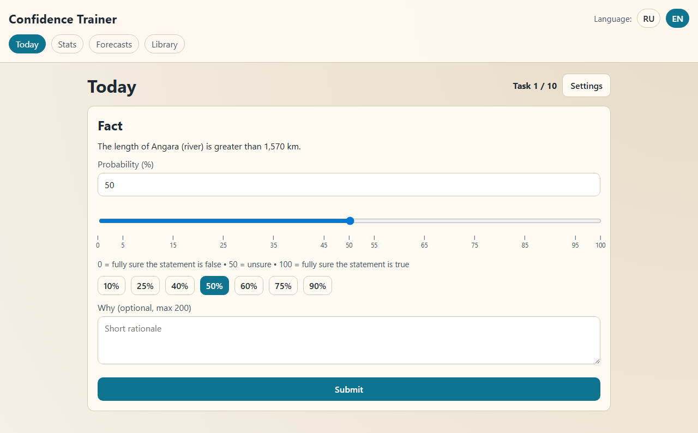
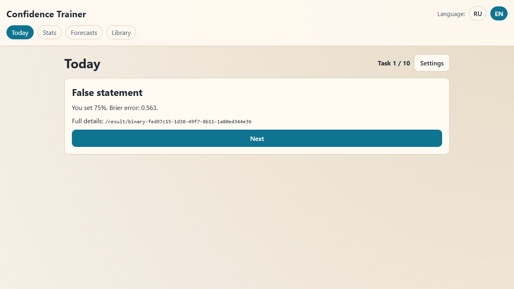

[English documentation](README.md).

# Confidence Trainer

Офлайн-тренажёр оценки вероятностей. Задавайте вероятность истинности утверждения, узнавайте ответ и ошибку Brier, отслеживайте калибровку. Личные прогнозы можно записывать и закрывать после выбранной даты.

Публичная бета 0.1.0. Это учебный инструмент с автоматически созданным банком вопросов; он не является проверенной оценкой навыка прогнозирования.





## Установка и запуск

Нужны Node.js 22.12 или новее и npm; в исходной инструкции рекомендован Node 24. Ключи API и серверный аккаунт не нужны.

```sh
npm ci
npm run dev -- --host 127.0.0.1
```

Откройте адрес, который напечатает Vite. Для офлайн-версии:

```sh
npm run build
npm run preview -- --host 127.0.0.1 --port 4173 --strictPort
```

Сначала откройте http://127.0.0.1:4173 с сетью и дождитесь установки service worker. Следующие посещения того же адреса работают без сети. Режим разработки не воспроизводит офлайн-работу production-сборки.

Для размещения нужны HTTPS, отдельный домен с приложением в корне и перенаправление SPA-маршрутов на `index.html`. Размещение в подпапке не настроено.

## Возможности

| Возможность | Описание |
|---|---|
| Ежедневная сессия | Десять бинарных утверждений с ответом после оценки |
| Ошибка Brier | `(вероятность − исход)²`; меньше означает лучше |
| Статистика | Калибровочные интервалы, гистограмма уверенности и разрез по темам |
| Личные прогнозы | Локальная дата и время, последующее закрытие «Да/Нет» |
| Языки | Русский и английский; выбор сохраняется |
| Офлайн | IndexedDB и production PWA |

## Хранение данных

Ответы и прогнозы остаются в текущем профиле браузера и на текущем адресе сайта. Облачной синхронизации, аккаунтов, аналитики, экспорта и резервной копии нет. Очистка данных сайта удаляет прогресс. Банк поставляется со сборкой и при использовании не обновляется из сети.

## Ограничения банка

Снимок от 22.02.2026 содержит 2067 двуязычных записей: 1764 географических сравнения с порогом и 303 исторических сравнения. Пороговые вопросы используют 146 объектов; записи не являются независимыми фактами. Вопросов по науке нет, хотя интерфейс поддерживает такую тему.

Защита от повторов учитывает ID вопроса, а не объекта. Повторяющиеся пороги могут научить значению и повлиять на следующие оценки. Утверждения о населении относятся к указанному году. У некоторых данных Wikidata нет источника или есть конкурирующие значения. Весь банк не проходил независимую проверку фактов. См. [выборочную проверку](docs/bank-review.md).

## Проверки

```sh
npm ci
npx playwright install chromium
npm run test
npm run lint
npm run validate:bank
npm run e2e
```

E2E собирает приложение и запускает production preview; порт 4173 должен быть свободен. Проверяются ответы, сессия из десяти заданий, дата и закрытие прогнозов, сохранение RU/EN и офлайн-перезагрузка с ответом на вопрос. Скриншоты и трассировки исключены из Git.

`npm run gen:bank` заново создаёт банк из Wikidata и может обращаться к сети. Это не этап установки или обычного использования. Кэш не публикуется; перед коммитом обновлённого банка проверьте ответы и метаданные.

## Технологии и лицензия

React, TypeScript, Vite, Dexie, vite-plugin-pwa, Vitest и Playwright. Код: [MIT](LICENSE). Структурированные данные Wikidata: CC0, см. [атрибуцию](DATA-LICENSE.md). Зависимости сохраняют собственные лицензии.
